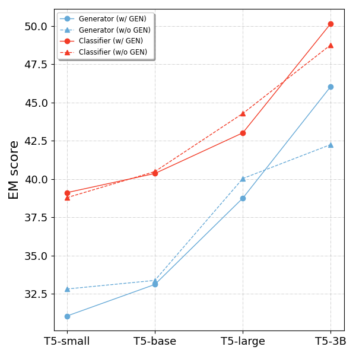

# Tk-Instruct

The code is based on the [Tk-Instruct](https://github.com/yizhongw/Tk-Instruct).

## Requirements

Our main experiments and analysis are conducted on the following environment:

- CUDA (11.3)
- cuDNN (8.2.0.53)
- Pytorch (1.10.0)
- Transformers (4.17.0)
- DeepSpeed

You can refer to the [Dockerfile](Dockerfile) for setting up the environment and install the required python libraries by running

```bash
pip install -r requirements.txt
```

Note: after the main exploration with 3B model, we train our 11B model on TPUs using the T5 code [here](https://github.com/google-research/text-to-text-transfer-transformer).

## Data

Our models are trained and evaluated on [Super-NaturalInstructions](https://github.com/allenai/natural-instructions), which can be cloned by running:

```bash
git clone git@github.com:allenai/natural-instructions.git data
```

## Training

Use the following scripts to train and eval (all the hyper-parameters are emperically decided).

- Default T5 encoder-decoder (generator):

```bash
sh scripts/train_generator.sh 6 4 t5-3b 0 1e-5 ## GPU, batch size, model name, whether mixing generation tasks (0/1), learning rate
python read_results.py --path output_generator/  ## read the results
```


- T5 encoder-classifier (binary single-label classifier):

```bash
sh scripts/train_classifier.sh 2 8 t5-large 1 5e-5  ## GPU, batch size, model name, whether mixing generation tasks (0/1), learning rate
python read_results.py --path output_classifier  ## read the results
```

### Evaluation

After above training, the **eval results on the cls tasks** will be saved.

- generator: `output_generator/` and `output_generator/eval_on_gen`

The eval results on cls tasks will be saved to `output_generator/`; if you want to load the trained generator and evalute it on the generation tasks, run `sh scripts/eval_generator.sh 2 32 t5-small 1` (same args as training), the results will be saved at `output_generator/eval_on_gen`.

Use `python calculate_overall_metric.py --cls_eval_path ./output_generator` to combine the results of cls and gen tasks; saved to `overall_predict_results.json`.

- classifier: `output_classifier/`

You can also use `python calculate_overall_metric.py` to get an overall metrics, i.e., using the gen results of generator.

### Read overall results

`python read_results.py` only read the results on the cls tasks. So, use `python read_overall_results.py` to print the overall results.

## Results

### 1. comparison between generator and classifier (w/ and w/o generation tasks)


<!-- All the models below can train w/ or w/o generation tasks.  -->

Evaluation results on the *unseen* classification tasks of SuperNI's test set (**64/119**). Totally **6,400** test instances. 

Evaluation metric: Exact Match (EM) score, which is equivalent to accuracy (we use the [default metric scripts](./src/compute_metrics.py) of SuperNI).

> Before calculating the score, both predictions and ground-truths are normalized (lower-cased and remove punctuations); note that one instance can have multiple ground-truths, so we calculate the max score over all the ground-truths.

#### Table

<table style="height: 91px;" width="642">
<tbody>
<tr style="height: 18px;">
<td style="height: 36px; width: 125.391px;" rowspan="2"><strong>Model</strong></td>
<td style="text-align: center; height: 18px; width: 268.852px;" colspan="2">
<p><strong>Generator</strong></p>
</td>
<td style="text-align: center; height: 18px; width: 225.758px;" colspan="2">
<p><strong>Classifier</strong></p>
</td>
</tr>
<tr style="height: 18px;">
<td style="text-align: center; height: 18px; width: 140.453px;"><strong>w/o GEN</strong></td>
<td style="text-align: center; height: 18px; width: 122.398px;"><strong>w/ GEN</strong></td>
<td style="text-align: center; height: 18px; width: 117.383px;"><strong>w/o GEN</strong></td>
<td style="text-align: center; height: 18px; width: 102.375px;"><strong>w/ GEN</strong></td>
</tr>
<tr style="height: 18px;">
<td style="height: 18px; width: 125.391px;"><strong>T5-small</strong></td>
<td style="text-align: center; height: 18px; width: 140.453px;">32.81</td>
<td style="text-align: center; height: 18px; width: 122.398px;">31.05</td>
<td style="text-align: center; height: 18px; width: 117.383px;">38.78</td>
<td style="text-align: center; height: 18px; width: 102.375px;">39.11</td>
</tr>
<tr style="height: 18px;">
<td style="height: 18px; width: 125.391px;"><strong>T5-base</strong></td>
<td style="text-align: center; height: 18px; width: 140.453px;">33.38</td>
<td style="text-align: center; height: 18px; width: 122.398px;">33.11</td>
<td style="text-align: center; height: 18px; width: 117.383px;">40.48</td>
<td style="text-align: center; height: 18px; width: 102.375px;">40.36</td>
</tr>
<tr style="height: 18px;">
<td style="height: 18px; width: 125.391px;"><strong>T5-large</strong></td>
<td style="text-align: center; height: 18px; width: 140.453px;">40.03</td>
<td style="text-align: center; height: 18px; width: 122.398px;">38.75</td>
<td style="text-align: center; height: 18px; width: 117.383px;">44.28</td>
<td style="text-align: center; height: 18px; width: 102.375px;">43.02</td>
</tr>
<tr style="height: 19px;">
<td style="height: 19px; width: 125.391px;"><strong>T5-3B</strong></td>
<td style="text-align: center; height: 19px; width: 140.453px;">42.25</td>
<td style="text-align: center; height: 19px; width: 122.398px;">46.05</td>
<td style="text-align: center; height: 19px; width: 117.383px;">48.77</td>
<td style="text-align: center; height: 19px; width: 102.375px;">50.16</td>
</tr>
</tbody>
</table>

#### Plot



#### Observation

1. **The Classifier is generally better than the Generator**, because the intrinsic benefits of classification paradigm (see my case study).
    - Note that even a t5-base + random-initialized classifier can achieve 38.80 EM, outperforming the fine-tuned t5-large generator.
2. **Adding generation tasks in training can improve both the cls performances of classifier and generator**, only if the model is large enough (e.g., T5-3B).
    - Though I conjecture that the improvement of classifier is mainly due to the balanced training data.
        - No GEN mixed:
        .png) 
        - GEN mixed (balanced pos and neg):
        .png)
    

### 2. overall results comparison (on the whole test set of SuperNI)

1. **05/24**; use seperate models for different tasks (generator on gen tasks; classifier on cls tasks); only improve the performance of cls.


TODO:
 - how to unify cls & gen? 
 - my current idea is to use this binary classifier to classify multiple generation candidates of the generator; 
 - so how to get various generation candidates?
    1. **vary instructions** because the model is usually sensitive to the instructions.
    2. **a novel decoding strategy** that can produce highly different outputs on the same instruction.